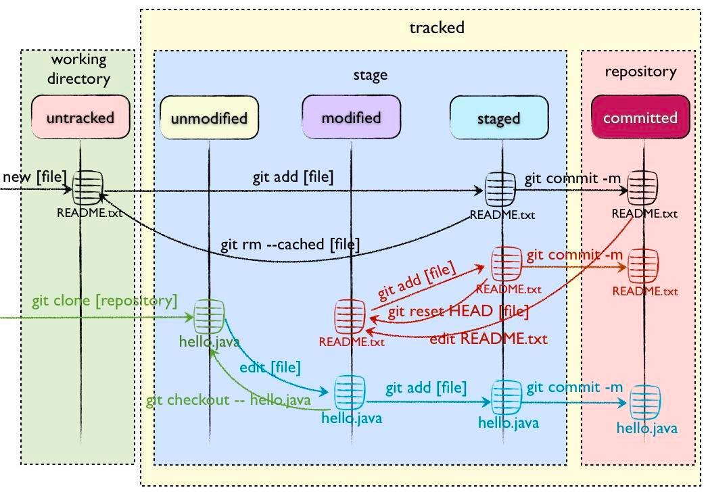

# Hello Git

## 基础配置

### 配置别名 git-log

```
touch ~/.bashrc
vim ~/.bashrc
alias git-log='git log --pretty=oneline --all --graph --abbrev-commit'
alias ll='ls -al'
source ~/.bashrc
```

## 基础命令

下面这个图可以帮助理解命令是如何改变文件的状态的。

<div align = center>  </div>

```
# 初始化
git init

# 查看日志
git log
git-log

# 查看状态
git status

# 添加到暂存区
git add <fileName>
git add <*>

# 从暂存区删除
git rm --cached <fileName>
git reset HEAD <fileName>

# 废弃当前修改
git checkout -- <fileName>

# 比较暂存区和版本库差异
git diff --staged

# 删除文件
git rm -rf <fileName>
# Hint: 不要```rm -rf *```!!!

# 提交
git commit -m "说明"

# 历史日志
git reflog

# 回退
git reset --hard <commitID>
```

## 分支命令

- Master: 主分支，通常保存官方发布历史
- Develop: 日常开发分支，集成各种功能开发的分支
- Feature：功能开发分支，每个新功能创建一个分支，完成开发后合并到Develop
- Release：预上线分支，发布提测阶段，以release分支代码为基准提测
- Hotfix：修复分支，线上出现问题时，以master分支为基线创建，合并到master和develop

```
# 查看分支
git branch <branchName>

# 创建分支
git branch <branchName>
# Hint: 常用分支：feature -> develop -> master/main，还有 hotfix, test, pre

# 切换分支
git checkout <branchName>

# 创建并切换分支
git checkout -b <branchName>

# 检查并删除分支
git branch -d <branchName>

# 强制删除分支（不进行检查）
git branch -D <branchName>
# Hint: 未完全 merge 时可用 -D 强制删除 。

# 删除分支后推送到远程
git push --delete <branchName>

# 重命名分支名称
git branch -M <main>

# 版本命名 Tag
git tag -a <v0.1> -m '部署包版本名'
```

### merge 合并分支

```
git merge <branchName>
```

Hint: 如果有冲突会将冲突位置标注，手动解决后可add和commit 。

- 手动修改产生冲突的文件，然后以add commit命令提交
- 保留当前分支修改: ```git checkout --ours  <file>```
- 保留合并分支修改: ```git checkout --theirs <file>```
- 放弃合并：```git merge --abort```

### rebase 

功能：在另一个分支基础之上重新应用，用于把一个分支的修改合并到当前分支
- 减少分支合并交叉，保持历史提交整洁
- 合并当前分支多个提交记录
  
```
# 进入交互界面
git rebase -i
```

## 远程仓库

### windows 生成密钥对

```
ssh-keygen -t rsa
```

Hint: 可自行设置保存密钥的文件名以生成多个密钥 。

### 测试连接 github

```
ssh -T <git@github.com>
```

### 添加远程仓库

```
git remote add origin <http://...>
```

### 查看远程仓库

```
git remote
```

### 将本地 push 到远程仓库

```
git push origin main
git push origin main:main
git push [-f] [--set-upstream] [远端名称 [本地分支名][:远端分支名]]
git push
```

- -f : 强制覆盖

- --set-upstream : push 时建立对应关系

### 查看对应关系

```
git branch -vv
```

### 从远程仓库克隆

```
git clone <仓库路径> [本地目录]
```

### 从远程仓库抓取

```
git pull
```

### fetch+merge

### 从远程仓库拉取

```
git fetch
git merge origin/main
```

Hint: 远程分支也是分支 。
