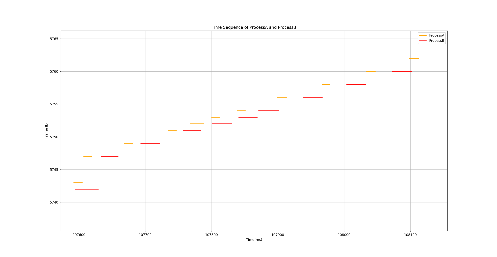

# Trace 性能分析工具

## 主要思路

首先过滤需要的信息，并从中提取数据存储到 json 文件中。然后对于三个需要评估的指标分别编写类和对应的方法实现需要的功能。

## 过滤信息和提取数据

1. 过滤信息，只保留需要处理的字段，可根据"static_multistream"进行过滤。

2. 日志文件是字符串，可以在过滤信息的同时对字符串内的信息进行匹配提取，将提取到的字段存到字典中。可使用正则表达式提取数据如下：

    ```获取信息
    import re
    pattern = re.compile(r'static_multistream\|frame_id:(\d+))\|timestamp:-1\|cpu:\d+\|(\w+):(\w+):(\d+)')
    data = pattern.search(line)
    ```

3. 字典的结构如下：

    ```嵌套字典
    # 可使用字典的字典或者列表的字典
    frame_info = {'frame_id1':info1, 'frame_id2':info2, ...}
    info = {'ProcessA_start':a_start, 'ProcessA_end':a_end, 'ProcessB_start':b_start, 'ProcessB_end':b_end}
    # 或者
    info = [ProcessA_start, ProcessA_end, ProcessB_start, ProcessB_end]
    ```

综合上述思路，将数据过滤和提取这一步写成一个类如下：

```DataExtract 类
import re
import json

class DataExtract:
    """提取log文件中的数据，并将数据存入字典中，并提供输出json文件的功能"""
    def __init__(self, log_file_path=None):
        self.data = {}
        if log_file_path:
            self.extract_data(log_file_path)

    def extract_lines(self, log_file_path):
        """读取log文件的每一行"""
        # --snip--
    
    def extract_data(self, log_file_path):
        """提取log文件中的数据，可利用正则表达式"""
        """读取log文件的每一行"""
        # --snip--
    
    def output_json(self, output_json_path):
        """将提取的数据输出到json文件"""
        """读取log文件的每一行"""
        # --snip--

```

## 各工序的耗时

在数据过滤和提取时，已经将需要的数据存入 data.json 文件。为了获取各工序的耗时，需要读取 json 文件中的数据并遍历计算各工序的耗时，并将得到的耗时保存。因此可以写一个类，使用一个变量保存耗时，提供方法计算耗时并保存、根据耗时计算平均耗时、P99耗时、P90耗时。类如下：

```ProcessTimeCost 类
import json

class ProcessTimeCost:
    """计算每个工序的时间消耗，并提供平均耗时、99分位耗时、90分位耗时的计算"""
    def __init__(self, data_file_path=None):
        """初始化，
        ProcessA_time_cost为字典，以 帧id 为主键，保存 ProcessA 的时间消耗，
        ProcessB_time_cost为字典，以 帧id 为主键，保存 ProcessB 的时间消耗。
        """
        self.ProcessA_time_cost = {} # {frame_id: ProcessA_time_cost, ...}
        self.ProcessB_time_cost = {} # {frame_id: ProcessB_time_cost, ...}
        if data_file_path:
            self.calculate_time_cost(data_file_path)

    def calculate_time_cost(self, data_file_path):
        """计算每个工序的时间消耗，并将结果存入字典中和列表中"""
        # --snip--
    
    def get_ProcessA_time_cost(self):
        """返回ProcessA的时间消耗字典"""
        # --snip--
    
    def get_ProcessB_time_cost(self):
        """返回ProcessB的时间消耗字典"""
        # --snip--
    
    def get_ProcessA_average_time_cost(self):
        """返回ProcessA的平均时间消耗"""
        # --snip--
    
    def get_ProcessB_average_time_cost(self):
        """返回ProcessB的平均时间消耗"""
        # --snip--
    
    def get_ProcessA_p99_time_cost(self):
        """返回ProcessA的99分位时间消耗"""
        # --snip--
    
    def get_ProcessB_p99_time_cost(self):
        """返回ProcessB的99分位时间消耗"""
        # --snip--
    
    def get_ProcessA_p90_time_cost(self):
        """返回ProcessA的90分位时间消耗"""
        # --snip--
    
    def get_ProcessB_p90_time_cost(self):
        """返回ProcessB的90分位时间消耗"""
        # --snip--

    def output_ProcessA_json(self, ProcessA_output_json_path):
        """将ProcessA计算的结果输出到json文件"""
        # --snip--
    
    def output_ProcessB_json(self, ProcessB_output_json_path):
        """将ProcesssB计算的结果输出到json文件"""
        # --snip--

```

## 系统平均吞吐量和平均帧耗时

继续使用数据过滤和提取后得到的 data.json 文件，其中数据的主键为 帧id ，因此 key 的个数就是系统的总帧数，系统时间则可以根据最小绝对时间戳（第一帧的开始时间）和最大绝对时间戳（最后一帧的结束时间）得到。需要注意的是， 从 data.json 文件加载得到的数据是嵌套的列表而不是字典：
```[[frame_id1, {'ProcessA':×××, 'ProcessB':×××}], [frame_id2, {'ProcessA':×××, 'ProcessB':×××}], ...]```

```FrameTimeCost 类
import json

class FrameTimeCost:
    """计算平均吞吐量"""
    def __init__(self, data_file_path=None):
        self.data = {}
        self.frame_num = 0
        self.frame_time_cost = []
        self.max_time = None
        self.min_time = None
        if data_file_path:
            self.load_data(data_file_path)
            self.frame_num = len(self.data)
            self.max_time = self.__get_max_time()
            self.min_time = self.__get_min_time()
            self.__get_frame_time_cost()


    def load_data(self, data_file_path):
        """加载数据文件，同时计算帧数、最大时间、最小时间"""
        # --snip--
    
    def __get_max_time(self):
        """获取最大时间，即最后一帧的结束时间"""
        # --snip--


    def __get_min_time(self):
        """获取最小时间，即第一帧的开始时间"""
        # --snip--
    
    def __get_frame_time_cost(self):
        """获取每一帧的时间消耗"""
        # --snip--

    
    def get_average_throughput(self):
        """返回平均吞吐量"""
        # --snip--

    
    def get_acverage_frame_time_cost(self):
        """返回平均帧时间消耗"""
        # --snip--
```

## 输出结果

```输出结果
ProcessA的平均耗时：14.534236804564907 ms
ProcessA的99分位耗时：28 ms
ProcessA的90分位耗时：17 ms
ProcessB的平均耗时：27.698065601345668 ms
ProcessB的99分位耗时：69 ms
ProcessB的90分位耗时：34 ms
平均吞吐量：24.44979247323079 帧/秒
平均帧时间消耗：60.08987161198288 ms
```

## ProcessA和ProcessB的调度时序图

<div align = center>  </div>